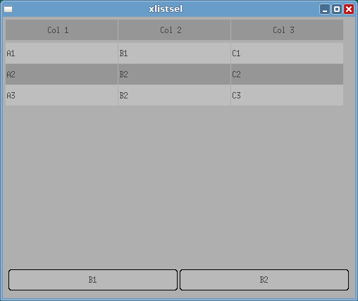
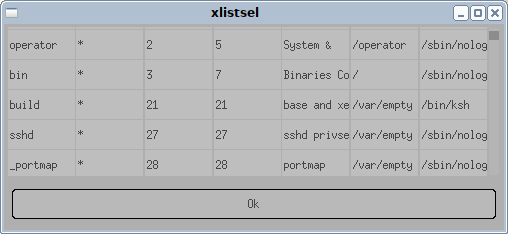
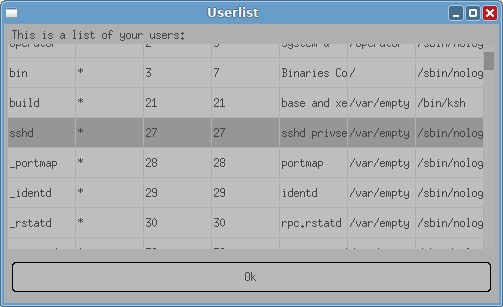
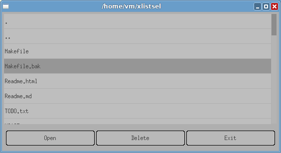
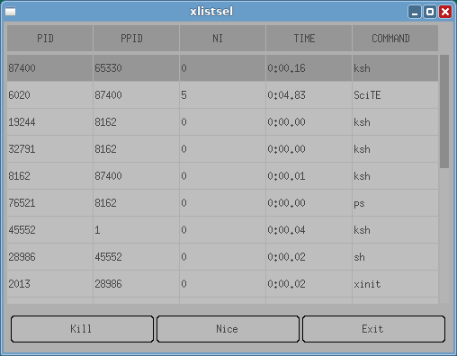
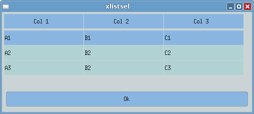
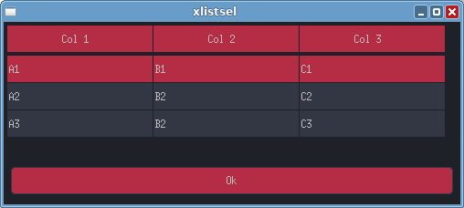
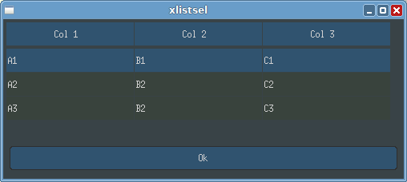

# xlistsel

A small utility to show up a list and let the user select one element.
Also the user can tell the executing script to perform various things by using
a configurable toolbar.

It is in the spirit of [dmenu](http://suckless.org/dmenu), but more interactive and should be simpler
to understand for non-geeks.

## Tutorial / Examples

### Demo Window

Running
```sh
xlistsel -b B1 -b B2 -T 'Col 1:Col 2:Col 3' A1:B1:C1 A2:B2:C2 A3:B2:C3
```

generates the following window:



the commandline works as below:

>`-b B1` and `-b B2` define the buttons  
>`-T 'Col 1:Col 2:Col 3'` define the table headers  
>`A1:B1:C1 ...` define the entries of the table  

### Various /etc/passwd examples

to display your `passwd` and select one entry, simply run 

```
xlistsel -i < /etc/passwd
```



>`-i` reads the table from stdin

To additionally have a nice Description etc. 

```
xlistsel -i -t Userlist -d 'This is a list of your users:' < /etc/passwd
```



>`-t title` sets the window's title  
>`-d desc` sets the text which is displayed above the list

When you want to actually do something with them you mostly
need some id which is typically one column of the table.
To extract a single column from the selected row, use the `-o` parameter

```
MYUSER=$(xlistsel -o 0 < /etc/passwd)
echo "the user you selected is: $MYUSER"
```

> `-o column` sets the selected colum that is written upon selection

### A little File Manager

When you want to do more with these list entries, you can add buttons
below the listbox with the `-b` Parameter. `xlistsel` returns the
button pressed as an errorlevel starting with `1` for the first button.
If the window is closed without pressing a button, `xlistsel` returns `0`
as errorlevel and does not print anything.
The following is a simple file manager which could be used in practice.
Notice that we need to track to case for the exit.

```
while true
do
	FILENAME=$(ls -a | xlistsel -b Open -b Delete -b Exit -t $PWD)
	BTN=$?
	case $BTN in
		0) break ;;
		3) break ;;
		1) [ -d $FILENAME ] && cd $FILENAME || xdg-open "$FILENAME" ;;
		2) echo rm "$FILENAME (just kidding)" ;; # well... we better avoid this here ;-)
	esac
done
```



### A little Task Manager

Another simple application created using a shellscript and xlistsel.
A very simple Taskmanager which lets you kill and renice tasks.
Note how we replaced `ps`'s output before feed to to xlistsel.
There must not be multiple delimiters separating the fields.

```sh
while true
do
	PID=$(
		ps -o pid,ppid,nice,time,comm | 
		sed -E 's/ +/|/g' | 
		xlistsel -s '|' -L -b Kill -b Nice -b Exit -o 0
	)
	case $? in
		0 | 3) exit;;
		1) kill $PID;;
		2) renice 10 $PID;;
	esac
done
```



### Theming

The default style may not be everyone's taste. The `nuklear` library,
which we use, supplies some example styles which are shipped with `xlistsel`.
These make it a bit more colorfull if you use the `-S style` flag.

```sh
xlistsel -S blue -T 'Col 1:Col 2:Col 3' A1:B1:C1 A2:B2:C2 A3:B2:C3 
```



```sh
xlistsel -S red -T 'Col 1:Col 2:Col 3' A1:B1:C1 A2:B2:C2 A3:B2:C3 
```



```sh
xlistsel -S dark -T 'Col 1:Col 2:Col 3' A1:B1:C1 A2:B2:C2 A3:B2:C3 
```



If you want to add more themes then get the source and adapt the file `style.c`.
Contributions are very welcome.

## Usage

For more details please see the man page.

```
xlistsel [options] [elem1 [elem2 [...]]]
Options:

  -b        Adds another button with supplied label below the list. 
            Can be supplied multiple times.
  -d        Sets a text which is displayed above the list.
  -E        If given, the dialog can be canceled by pressing the 'Esc' Key.
  -h        Shows the help and exists
  -H        set the height of the window in pixels
  -i        If given, the table to display is read from stdin. Arguments are ignored
  -L        If given, the first line of stdin will be a heading line.
            Implies '-i'
  -o        Column of the selected line to output. '-1' prints full line
  -O        sets the returncode/button when the user did press Enter
  -s        the character to split the input lines into colums.
            the line 'A:B:C' will be split to 'A', 'B' and 'C'
  -S        set color theme. available: black, white,red, blue or dark
  -t        Set the window's title
  -T        directly set a heading line
  -W        set the width of the window in pixels
```	

## Install / Compile

`xlistsel` ist developed and tested on OpenBSD. We try to stay `POSIX.1` 
compliant. It should work in every UN*X alike system. 

### Dependencies

- XLib
- C89 C Standard library, and a C89 compatible compiler
- Standard Posix Utilities `sh`, `sed`, `touch`, `install`, `cat`
- `make` (tested with BSD make, but gmake should work)

Optional Dependencies which make development more comfortable.
Neither of these is required to compile or even to contribute.

- `makedepend`
- `mandoc`

## Compile / install

1. Adapt the file `config.mk` to your system / compiler
	- Most important question: where is you X11 Directory.
2. `make`
3. `sodo make install` or `doas make install` or `su root -c 'make install'`

no cmake, qmake, premake, gyp or autotools needed.
The makefile is also rather trivial.

## Package Maintainers

the `xlistsel` project would be happy to support anyone who wants to
package this tool. We would love to incorporate required changes upstream
instead forcing you to patch. (But we will not use autotools!)

Just file an Issue or write a mail to xlistsel@jaak.de.

## State of the Project

We declare `xlistsel` to be mostly featurecomplete. Thus we'd rather fix bugs
then implement new stuff. Yet we're open to hear what you'd need.
Some changes are quick and simple to implement others are not... we'll see.
We don't want this tool to be able to read E-Mail.

### missing features

- multiple Selection
- Autosize of window
- font loading
- getuid()/getgid() == 0 -> set user nobody
- pledge when OpenBSD


## Alternatives

- zenity (gtk)
- quarma (qt, a clone of zenity)
- xdialog (gtk, a clone of the curses 'dialog' tool)
- gtkdialog (gtk, quite complicated but used by puppy linux for almost every task).
